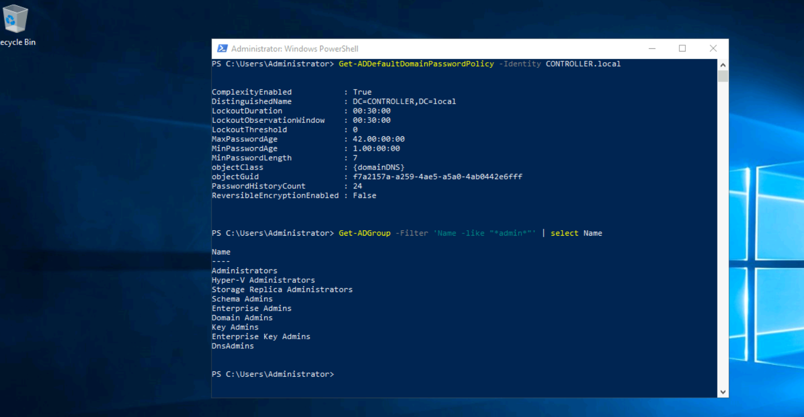

# Powershell Active Directory Enumeration
Enumeration is the most important step when we want to perform a pentest or we want to audit our AD system.
Using powershell instead of external tools will help us to avoid triggering alerts on defense systems (AV,SIEM etc). As we say communicate with a Dog in his language and he won't bite you (okay nobody said that but you've got the idea).

So here is a list of powershell commands for enumeration in Windows Active Directory environment. 

IMPORTANT : most of those commands are integrated to Active Directory module , you need to import it first before using them.

AD module link : https://github.com/samratashok/ADModule/blob/master/Microsoft.ActiveDirectory.Management.dll

- Enumerate Domain Users
```text
#Get Users in a specific Domain 
Get-ADUser -server Domaincontroller -Filter * -Properties *
#Get Users wit PasswordNotRequired set to true
Get-ADUser -server Domaincontroller -Filter {PasswordNotRequired -eq $true}
#Get user's accounts that do not Require Kerberos Preauthentication 
Get-ADUser -Filter 'useraccountcontrol -band 4194304' -Properties useraccountcontrol | Format-Table name
#Enumerate user accounts with serverPrincipalName attribute set
Get-adobject -filter {serviceprincipalname -like "*"}  | Where-Object {$_.distinguishedname -like "*CN=Users*" -and $_.name -ne "krbtgt"}
```

- Enumerate Domain Computers
```text
#Get Computers in a specific Domain 
Get-ADComputer -server Domaincontroller -Filter * -Properties *
#Get all active computer list in domain
Get-ADComputer -Filter {enabled -eq $true} -properties *
#Get computers with outdated OS (in this exemple we are looking for computers on Windows 7)
Get-ADComputer -Filter 'operatingsystem -like "*Windows 7*" -and enabled -eq "true"' -Properties *
```
- Enumerate Domain Trust:
```text
#Get the list of all trusts within the current domain
Get-ADTrust -Filter *               
#Get the list of all trusts within the indicated domain
Get-ADTrust -Identity us.domain.corporation.local   
```
- Enumerate File Shares:
```text
#Retrieves the SMB shares on the computer
Get-SmbShare
```
- Other Objects Enumeration:
```text
#Shows the tickets in memory
klist
#Get the default domain password policy from a specified domain
Get-ADDefaultDomainPasswordPolicy -Identity corp.local.com
#Get all groups that contain the word "admin" in the group name
Get-ADGroup -Filter 'Name -like "*admin*"' | select Name     
#Get all members of the "Domain Admins" group
Get-ADGroupMember -Identity "Domain Admins" -Recursive       
#Get group membership for a specific user
Get-ADPrincipalGroupMembership -Identity login001     
```



